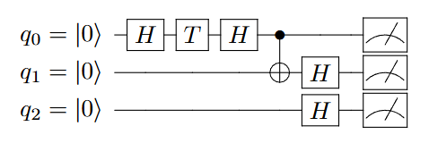

# PQSim - A Quantum Circuit Simulator based on Gate Excision
## Introduction
`PQSim` is a quantum circuit simulator based on our proposed gate excision technique. Furthermore, we use FPGA to achieve hardware speedups.

## Directory Structure
- `benchmark_new2/` : Benchmark circuits for query and sampling experiments.
There are 6 kinds of circuits : `dj_bal`, `dj_const`, `simon`,`random_t1`, `random_t2`, `random_t3`
- `benchmark_scalability/` : Benchmark circuits for scalability experiments
- `bit_file_new/` : Some example bit files for FPGA
- `cliffordT_template/` : Template verilog files for PQSim
- `vivado_srcs/` : Verilog codes for the Vivado projects
- `main.cpp` : Main codes for the simulator
- `makefile` : Makefile for compiling the codes
- `run_exp.py` : Code that run query and sampling experiments for a circuits
- `run_translator_new.sh` : Script that run the translator then copy the generated files to the project directory
- `SimpleSerial.h` : For UART communications
- `translator_new.py` : Code that read the circuits and generate necessary files for the simulator
- `weak_sim` : Binary executable of the simulator

## Execution
First run the circuit in the translator
```
python ./translator_new.py *.qasm
```
The translator will generates below files
- `*_out.qasm` : The circuits after cutting non-Clifford gates
- `cliffordT_template/Core.v`, `cliffordT_template/measureClifford.v`, `cliffordT_template/define.v` : generated verilog files for the Vivado project

With the generated verilog files, we then run synthesis, implementation, and write bitstream on the Vivado projects. After program the bitstream into the FPGA, we can run the simulator codes.

To compile the C++ codes, simply type
```
make
```
which need the `gmp` library (as we use this library for big number operations). The compiled binary executable is also given.

There are two modes for simulator : query mode and sample mode.

For query mode, type
```
./weak_sim [port name] -q [observables] [n_exp] [n_qubits]

    port_name : The name of UART port connect with FPGA e.g. /dev/ttyUSB0

    observables : The observables for measurements. Allow "0","1","I","X","Y","Z"

    n_exp : a constant relevant to the circuits. The value equals to (# of T gates + 3 * # of CCX gates)

    n_qubits : qubit numbers
```

For sample mode, type
```
./weak_sim [port name] -s [shots] [n_exp] [n_qubits] [n_measure]

    port_name : The name of UART port connect with FPGA. e.g. /dev/ttyUSB0

    shots : Number of sampling

    n_exp : a constant relevant to the circuits. The value equals to (# of T gates + 3 * # of CCX gates)

    n_qubits : qubits number

    n_measure : Number of measure qubits
```

※ It seems that the Vivado project might be broken if I just directly upload on Github.
For someone who want to reproduce the experiments, please refer to `vivado_srcs` directory for more information.

## Example
Here we use `example/example_circuit.qasm` as an example. Below is the circuit diagram.



First run the translator, then generate bitstream in the project with the generated verilog files. We also give the generated bitstream file `example/example_circuit.bit` here.

After programming the bitstream into the FPGA, we can start to simulate the circuit. Here the UART ports is `/dev/ttyUSB0`.

Query
```
$ ./weak_sim /dev/ttyUSB0 -q 000 1 3
Observable : 000
a = 4, b = 2, k = 5
Expectation value : 0.213388 (=(4 + 2√2)/32)
Query time : 0.016441 s
```
Sample
```
$ ./weak_sim /dev/ttyUSB0 -s 10000 1 3 3
000 : 2097
001 : 400
010 : 2140
011 : 329
100 : 2102
101 : 353
110 : 2172
111 : 407
Sample time : 0.123212 s
```

## TODO
Currently, we need to run synthesis and implementation for each circuit. This is very time comsuming.
To overcome this problem, we plan to rewrite our verilog codes to a more general version.

Instead of generating verilog files based on the circuits, we now input the information of circuits into the FPGA, such as qubits number, tableau, etc.
In this way, we don't need to generate bit file for each circuit.
We can just generate the bit file for the general version of codes, then use it for simulating different circuits.
This also increases the reproducibility of the experiments.

## Contact
If you have any questions or suggestions, feel free to [create an issue](https://github.com/NTU-ALComLab/PQSim/issues) or contact us.

Tian-Fu Chen - ghdftff542@gmail.com

Yu-Hung Pan - panc8763@gmail.com
