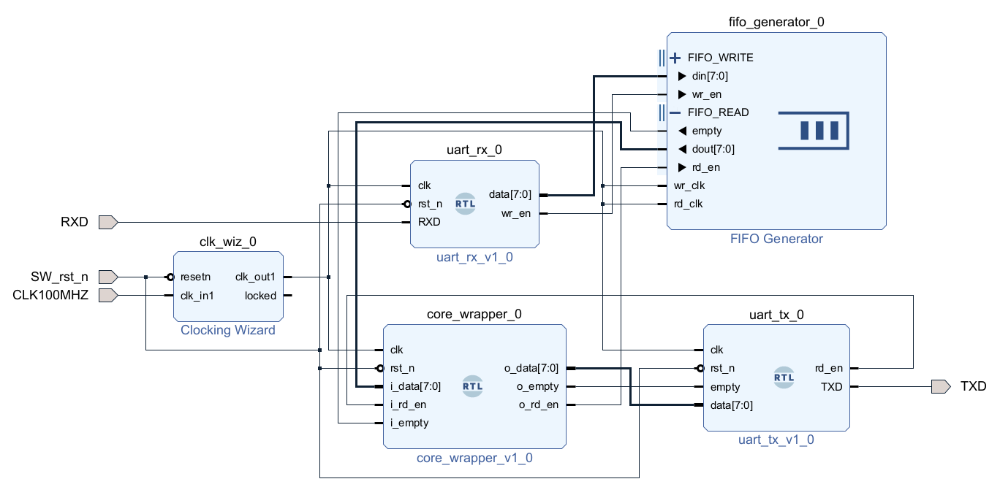

# Vivado project
Here we introduce our Vivado project.

*Vivado Version : 2024.1*

*FPGA : Nexys Video*

Below is the block diagram of our design. The design files can be found in this directory. We follow [this](https://fpga.eetrend.com/blog/2023/100573030.html) for UART communications (and FIFO settings). The clock frequency is changed from 100MHz to 50MHz by the clock wizard.

## Files
- `Block_diagram.png` : The block diagram of our design
- `core_wrapper.v` : The wrapper of `Core.v`. Dealing with UART inputs and outputs
- `Core.v` : Main part of our design
- `define.v` : Define some parameters for the design
- `measureClifford.v` : Submodule for the `Core.v`. Dealing with measurements of Clifford circuits
- `Nexys-Video-Master.xdc` : Constraint file for the FPGA we used
- `uart.v` : For UART communications